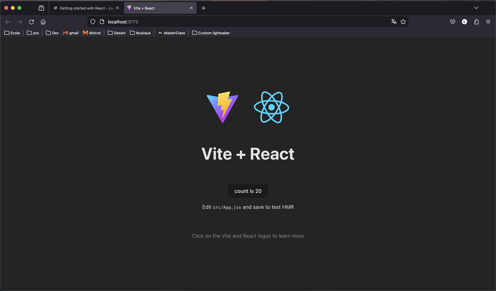

# ReactJS
## Initialisation du projet

Avant d'avoir configuré quoi que ce soit (donc hors répertoire actuel), si votre poste est connecté à internet, vous pouvez vous placer dans le répertoire dans lequel vous souhaitez développer votre application et lancer les commandes qui suivront. En premier lieu, assurez vous que NodeJS est installé sur votre machine :

```bash 
    node -v
```

Si node est installé, placez vous dans le répertoire en question via votre terminal de commande :

```bash 
    npm create vite@latest moz-todo-react -- --template react
```

Cette commande crée un répertoire moz-todo-react. Déplacez vous au sein de ce répertoire et lancez l'installation / configuration de votre projet via la commande 

```bash 
    cd moz-todo-react && npm install
``` 

Une fois ces étapes respectées, il faut lancer un serveur local :

```bash
    npm run dev -- --open port 3000
```

La fenêtre suivante devrait s'ouvrir : 



Il est désormais possible de développer.
